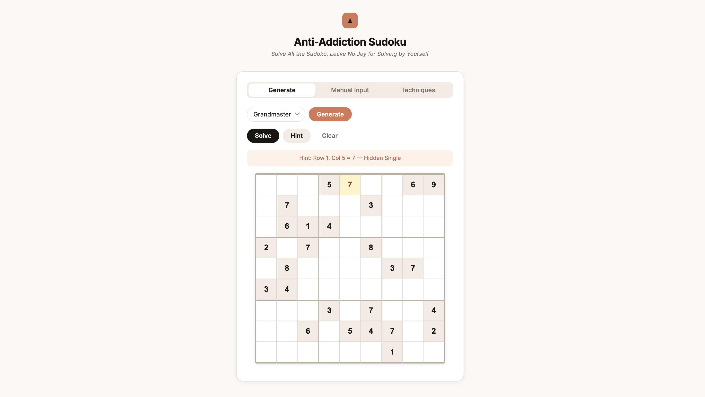

# Solve All the Sudoku, Leave No Joy for Solving by Yourself

A Sudoku-solving calculator with an ironic anti-addiction premise: instantly solve any Sudoku so you never have to think about one again.

If you have a friend addicted to Sudoku, share this with them. :)


## Setup

**Requirements:** Python 3.9+

```bash
# Install from PyPI
pip install anti-sudoku

# Or install from source
git clone https://github.com/yuhhong/Anti-addiction_Sudoku.git
cd Anti-addiction_Sudoku
pip install .
```


## Web UI



The web UI lets you generate puzzles or type one in manually, then solve it — or get step-by-step hints.

```bash
anti-sudoku serve
```

Opens `http://localhost:8000` in your browser automatically. Both the page and the API are served together.

### Features

- **Generate mode** — pick a difficulty (Easy / Hard / Master / Grandmaster) and click **Generate** to load a fresh puzzle
- **Manual Input mode** — click any cell and type a digit to enter your own puzzle
- **Solve** — fills the entire board instantly
- **Hint** — fills one cell and tells you which technique was used (e.g. *"Row 4, Col 7 = 3 — X-Wing"*)
- **Clear** — resets the board


## CLI

```bash
# Solve a puzzle file
anti-sudoku solve anti_sudoku/puzzles/hard_001.txt

# Solve from a string (dots = blank cells)
anti-sudoku solve --input "53..7...."

# Generate a puzzle and print it
anti-sudoku generate --difficulty grandmaster

# Reproducible generation with a seed
anti-sudoku generate --difficulty hard --seed 42

# Start the web UI
anti-sudoku serve
anti-sudoku serve --host 0.0.0.0 --port 9000 --no-browser
```

**Difficulty levels:** `easy` · `hard` · `master` · `grandmaster`


## Python Package

```python
from anti_sudoku import solve, hint, generate

# Generate a puzzle (returns 81-char string, dots = blank)
puzzle = generate(difficulty="hard")
puzzle = generate(difficulty="grandmaster", seed=42)  # reproducible

# Solve a puzzle
solution = solve(puzzle)           # pass the string back in
solution = solve([0,5,3,0,...])    # or a list of 81 ints (0 = blank)
# Returns same type as input, or None if unsolvable

# Get one hint at a time
h = hint(puzzle)
# {"row": 3, "col": 6, "value": 7, "technique": "Hidden Single"}
```

### Supported input formats

| Format | Example |
|--------|---------|
| 81-char string | `"53..7.486..."` — digits 1-9, dots for blank |
| list of 81 ints | `[5,3,0,0,7,0,4,8,6,...]` — 0 for blank |

### Hint techniques

The hint function uses the simplest technique that currently applies:

| Technique | Description |
|-----------|-------------|
| Naked Single | Only one candidate remains in a cell |
| Hidden Single | A digit has only one valid position in a group |
| Naked Pairs/Triples | N cells share exactly N candidates — eliminate from rest of group |
| Hidden Pairs/Triples | N digits confined to N cells — eliminate other candidates from those cells |
| Pointing Pairs | Digit in a block confined to one row/col — eliminate outside the block |
| X-Wing | Digit in 2 rows shares the same 2 columns — eliminate from those columns |
| Swordfish | X-Wing extended to 3 rows/columns |
| Backtracking | Used only when no deterministic technique applies |

## Puzzle files

Built-in puzzles are in `anti_sudoku/puzzles/`. Format: space-separated digits, `-` for blank cells.

```
- 1 4 - 9 - - 7 -
8 - - 4 - - - 6 3
...
```

---

## Reference

```
@inproceedings{simonis2005sudoku,
  title={Sudoku as a constraint problem},
  author={Simonis, Helmut},
  booktitle={CP Workshop on modeling and reformulating Constraint Satisfaction Problems},
  volume={12},
  pages={13--27},
  year={2005},
  organization={Citeseer}
}
```
